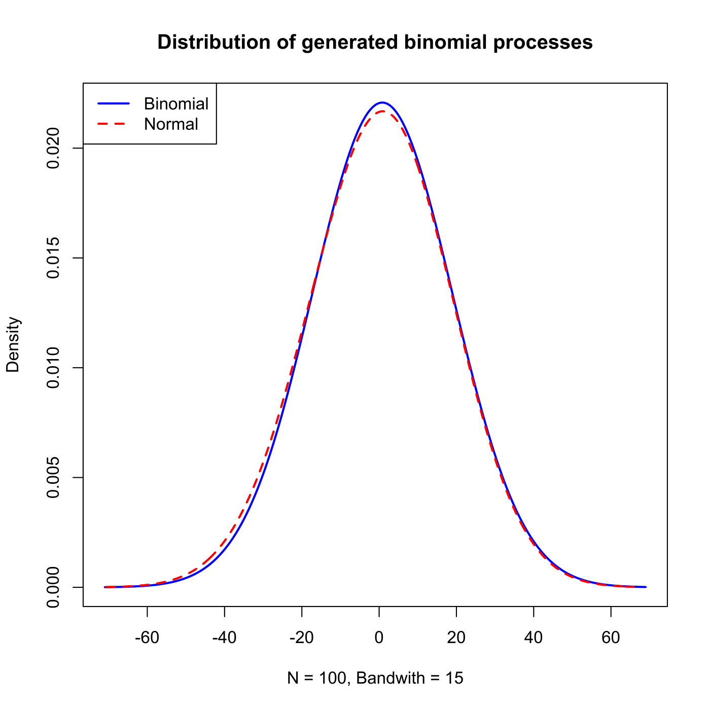

[](http://quantlet.de/index.php?p=info)

## [](http://quantlet.de/) **SFEbinomv**[](http://quantlet.de/d3/ia)

```yaml
Name of QuantLet : SFEbinomv

Published in: Statistics of Financial Markets

Description: 'Plots and compares the density of generated binomial processes with the density of normally distributed random variables.'

Keywords: 'binomial, density, distribution, estimation, graphical representation, kernel, normal, normal-distribution, plot, process, random-number-generation'

See also: SFEBinomp, SFEWienerProcess, SFEbinomv_log

Author: Cindy Lamm, Ying Chen, Christian M. Hafner
Author[Matlab]: Ying Chen, Christian M. Hafner

Submitted: Sat, June 13 2015 by Lukas Borke
Submitted[Matlab]: Wed, April 27 2016 by Ya Qian

Input:
- n : number of steps
- k : number of paths
- p : probability of up movement

Example: 'User inputs the parameters n, k, p, then the density of generated binomial processes with the normal density is plotted.'

```


.png)

### R Code:
```r

# clear variables and close windows
graphics.off()
rm(list = ls(all = TRUE))

# Define function
SFEbinomv = function(n, k, p) {
    if (n <= 0) {
        stop("please input n > 0!")
    }
    if (k <= 0) {
        stop("please input k > 0!")
    }
    if (p <= 0 | p >= 1) {
        stop("please choose p in the interval of (0,1)!")
    }
    
    n = floor(n)  # makes sure number of steps is integer
    k = floor(k)  # makes sure number of path is integer
    
    # main computation
    set.seed(0)
    z        = matrix(runif(n * k), n, k)
    z        = ((floor(-z + p)) + 0.5) * 2      # scale ordinary binomial processes
    x        = apply(z, MARGIN = 2, FUN = sum)  # end values of the k binomial processes
    h        = 0.3 * (max(x) - min(x))          # bandwidth used to estimate the density of end values
    xdens    = density(x, bw = h)               # Kernel-based density estimation with specified bandwidth
    trend    = n * (2 * p - 1)
    std      = sqrt(4 * n * p * (1 - p))
    norm     = std * rnorm(k) + trend
    normdens = density(norm, bw = h)
    
    # plot of densities
    plot(xdens$x, xdens$y,xlab='N = 100, Bandwith = 15', ylab='Density', type = "l", lwd = 2, col = 4, 
		xlim = c(min(xdens$x, normdens$x), max(xdens$x, normdens$x)), ylim = c(min(xdens$y, normdens$y), 
		max(xdens$y, normdens$y)), main = "Distribution of generated binomial processes")
    lines(normdens$x, normdens$y, col = 2, lwd = 2, lty = 2)
    legend("topleft", c("Binomial", "Normal"), col = c(4, 2), lwd = 2, lty = 1:2)
}

# enter parameters as n = 100 (number of steps), k = 100 (number of paths), p = 0.5 (probability of up movement)
SFEbinomv(n = 100, k = 100, p = 0.5) 
```
### Matlab Code
```matlab

clear
close all
clc

% user inputs parameters
disp('Please input steps n, paths k, Probability of up p as: [100, 1000, 0.5]');
disp(' ') ;

para=input('[n k p]=');

while length(para) < 3
  disp('Not enough input arguments. Please input in 1*3 vector form like [100, 1000, 0.5] or [100 1000 0.5]');
  disp(' ') ;
  para=input('[n k p]=');
end

n=para(1);
k=para(2);
p=para(3);
if (p>1)|(p<0)
  disp('Probability is to be between 0 and 1, please input p again!')
  p=input('p=');
end

% main computation
t=1:n;
trend=n*(2*p-1);
std=sqrt(4*n*p*(1-p));
rand('state',0);
z=rand(n,k);
z=((floor(-z+p))+0.5)*2;
x=sum(z); 
h = 0.3*(max(x)-min(x));
[f,xi] = ksdensity(x, 'width', h);      % Kernel-based density estimation with specified bandwidth
norm=std*randn(k,1)+trend;
[nf,nxi] = ksdensity(norm, 'width', h);

% plot
hold on
plot(xi, f,'LineWidth',2,'Color','b');
plot(nxi, nf,'LineWidth',2,'Color','r','LineStyle','-.');
legend('Normal','Binomial',2);
title(sprintf('Distribution of generated binominal processes'))  
hold off
```
